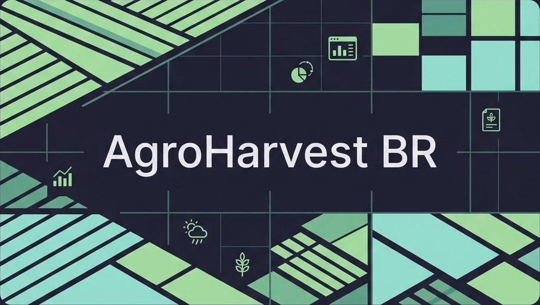
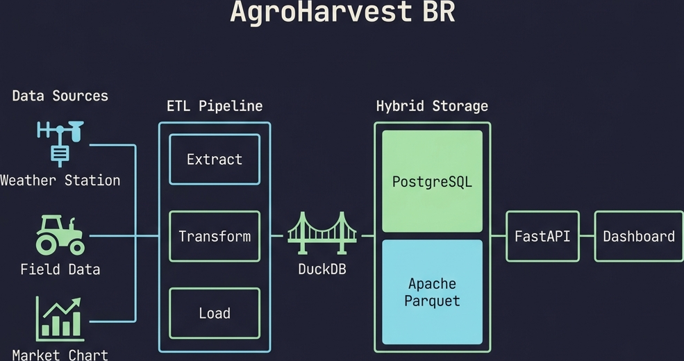

# AgroHarvest BR - Pipeline de Dados Agrícolas



## 🏗️ Arquitetura do Sistema


Este projeto é uma solução de **Engenharia de Dados** focada na integração de múltiplos datasets do setor agrícola brasileiro.
 Ele consolida informações de registros de cultivares (RNC), produção agrícola municipal (PAM) e zoneamento de risco climático (ZARC) em um data warehouse estruturado.

## 🚀 Objetivo

O objetivo principal é criar um ambiente unificado para análise de dados agro, permitindo correlacionar a oferta de tecnologias (cultivares registradas) com o desempenho produtivo (IBGE/SIDRA) e a viabilidade climática (MAPA/ZARC). O projeto foi concebido para ser escalável, com a visão de integrar diversas outras fontes de dados governamentais e privadas no futuro.

## 🖥️ Dashboard - Visualização de Dados


*Visualização analítica consolidada no Metabase, integrando fluxos de produção (PAM), viabilidade climática (ZARC) e registros genéticos (RNC/SIGEF).*

## 📊 Fontes de Dados

O pipeline extrai e processa dados das seguintes fontes:

1.  **MAPA/SNPC (CultivarWeb):** Registro Nacional de Cultivares (RNC). Fornece dados sobre variedades genéticas certificadas, mantenedores oficiais, portarias de registro e proteção de cultivares.
2.  **IBGE/SIDRA (PAM):** Produção Agrícola Municipal. Séries anuais consolidadas sobre área plantada, área colhida, quantidade produzida e valor da produção para 60+ culturas temporárias e permanentes.
3.  **MAPA/ZARC:** Zoneamento Agrícola de Risco Climático. Define as janelas de plantio ideais por município, cruzando tipos de solo (textura) e ciclos de cultivares para mitigar perdas climáticas.
4.  **CONAB:** Séries históricas de produção, produtividade e preços médios pagos ao produtor, fundamentais para análises de mercado e viabilidade econômica de safras.
5.  **MAPA/Agrofit:** Sistema de Agrotóxicos Fitossanitários. Base de dados sobre defensivos registrados no Brasil, incluindo alvos biológicos (pragas), formulações e orientações técnicas.
6.  **MAPA/SIPEAGRO:** Registro de estabelecimentos produtores e importadores de fertilizantes, corretivos e inoculantes, mapeando a infraestrutura de insumos nutricionais.
7.  **MAPA/SIGEF (Sementes):** Controle e fiscalização da produção de sementes e mudas, garantindo a rastreabilidade e a qualidade da tecnologia genética aplicada no campo.
8.  **INMET (Meteorologia):** Rede de 700+ estações automáticas que fornecem indicadores diários de precipitação, temperatura e umidade para cruzamento com o desempenho das safras.


## 🛠️ Tecnologias Utilizadas

-   **Linguagem:** Python 3.12+
-   **Análise de Dados:** Pandas, NumPy
-   **Banco de Dados:** PostgreSQL via SQLAlchemy (ORM)
-   **API:** FastAPI, Pydantic, Uvicorn
-   **Segurança:** SlowAPI (Rate Limiting)
-   **Testes Automáticos:** Pytest
-   **Infraestrutura:** Docker & Docker Compose
-   **BI/Dashboard:** Metabase
-   **CI/CD:** GitHub Actions

## 🏗️ Arquitetura do Projeto

O projeto segue uma arquitetura modular baseada em um modelo Estrela (Star Schema):

-   **Dimensões:** Cultura, Município, Mantenedor.
-   **Fatos:** Cadastro de Cultivares, Produção PAM, Risco ZARC, Produção/Preços CONAB, Agrofit, Fertilizantes, SIGEF e Meteorologia INMET.

## 📈 Performance e Escalabilidade (ZARC)

O AgroHarvest BR foi desenhado para lidar com volumes reais do agronegócio. O módulo **ZARC**, que processa milhões de registros de risco climático, utiliza:

-   **Carga via Streaming:** Processamento linha a linha para baixo consumo de memória RAM.
-   **Indexação Composta:** Uso de índices B-Tree no PostgreSQL em colunas de alta cardinalidade (`id_municipio`, `id_cultura`), garantindo que consultas analíticas sejam respondidas em milissegundos.
-   **Escalabilidade de Fonte:** É possível integrar novas culturas (Milho, Café, Arroz, etc.) apenas adicionando os CSVs brutos na pasta `data/zarc/` e rodando o pipeline.


### Estrutura de Diretórios

```text
.
├── docker/                 # Configurações Docker
│   └── app.Dockerfile      # Imagem única para ETL, API e Testes
├── docs/                   # Documentação técnica e schemas
├── src/                    # Código-fonte (Python root via PYTHONPATH)
│   ├── api/           # Camada de API (Endpoints, Routers, Schemas)
│   ├── db/            # Modelagem Star Schema (SQLAlchemy)
│   ├── pipeline/      # Extractors e Cleaners
│   │   └── cleaners/  # Lógica de limpeza desacoplada (Funcional)
│   └── main.py        # Orquestrador do pipeline de dados
├── tests/              # Suite de testes (Unitários e Integração API)
├── docker-compose.yml  # Orquestração de serviços (app, api, test)
└── DATABASE_METADATA.md # Dicionário de dados do banco
```

## ⚙️ Como Executar

### Pré-requisitos
-   Docker e Docker Compose instalados.

### Passo a Passo

1.  **Configurar Variáveis de Ambiente:**
    ```bash
    cp .env.example .env
    ```
    *Edite o arquivo `.env` se desejar alterar as credenciais padrão do banco de dados.*

2.  **Subir o ambiente e Executar o Pipeline:**
    ```bash
    docker-compose run --rm app
    ```
    *Este comando inicializa o banco de dados PostgreSQL e executa o processo de extração completo.*

2.  **Subir a API e Acessar Documentação:**
    ```bash
    docker-compose up api
    ```
    *Acesse `http://localhost:8000/docs` para visualizar a documentação interativa (Swagger).*

3.  **Executar Testes de Integração e Unitários:**
    ```bash
    docker-compose run --rm test
    ```

## ⚖️ Licença e Uso de Dados

- **Código:** Este projeto está sob a licença [MIT](LICENSE).
- **Dados:** O projeto utiliza bases de dados públicas regidas pela Lei de Acesso à Informação (LAI) e decretos federais de Dados Abertos. Ao utilizar este código para novos fins, respeite as seguintes atribuições das fontes primárias:

- **IBGE (SIDRA/PAM):** Dados públicos sob os [Termos de Uso do IBGE](https://www.ibge.gov.br/institucional/o-ibge/termos-de-uso.html). A citação da fonte é obrigatória.
-   **CONAB:** Dados sob licença [CC BY-ND 3.0](https://creativecommons.org/licenses/by-nd/3.0/br/). A reprodução é permitida para fins não lucrativos com citação obrigatória da fonte. 
-   **MAPA (ZARC, RNC, Agrofit, Fertilizantes, SIGEF):** Dados abertos conforme o [Decreto nº 8.777/2016](http://www.planalto.gov.br/ccivil_03/_ato2015-2018/2016/decreto/d8777.htm).
-   **INMET:** Dados públicos regidos pela LAI. A citação da fonte (**Instituto Nacional de Meteorologia - INMET**) é obrigatória conforme normas técnicas.

---
*Este projeto faz parte de um portfólio de engenharia de dados (AgroHarvest BR) focado em agronegócio.*
