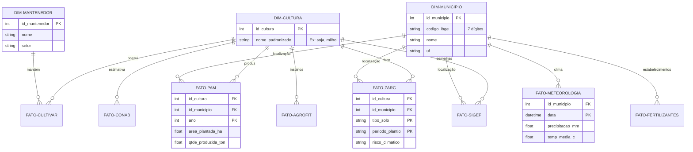
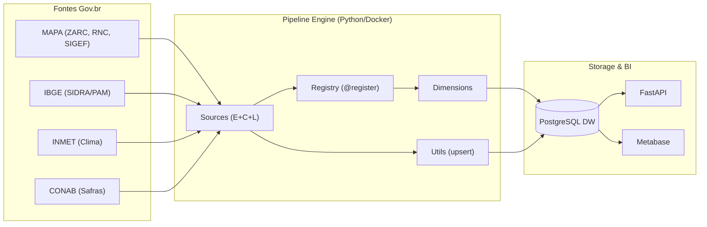

# AgroHarvest BR - Arquitetura e Modelagem

Este documento detalha a estrutura de dados e o fluxo de informações do projeto AgroHarvest BR.

## 1. Modelo de Dados (Star Schema)

Abaixo está o diagrama Entidade-Relacionamento (ERD) que detalha como as dimensões e fatos se relacionam no PostgreSQL. Este modelo foi desenhado para otimizar consultas analíticas e reduzir a redundância de dados.



## 2. Fluxo de Dados (Pipeline ETL — Registry Pattern)

O pipeline utiliza o **Registry Pattern**: cada fonte de dados é uma classe autocontida (`extract + clean + load`) registrada via decorator `@register`. O orquestrador descobre e executa as fontes automaticamente, sem necessidade de configuração manual.



### Estrutura de Diretórios

```
src/
├── main.py                     # Orquestrador genérico (~65 linhas)
├── db/
│   └── manager.py              # ORM Models (Star Schema)
├── pipeline/
│   ├── registry.py             # @register decorator + discovery
│   ├── base.py                 # Contrato BaseSource (E+C+L)
│   ├── utils.py                # upsert_data, normalize_string, get_cultura_id
│   ├── dimensions.py           # DimCultura, DimMunicipio, DimMantenedor
│   └── sources/
│       ├── cultivares.py       # SNPC/MAPA
│       ├── sidra.py            # PAM/IBGE
│       ├── zarc.py             # Risco Climático (streaming)
│       ├── conab.py            # Produção + Preços
│       ├── agrofit.py          # Agrotóxicos
│       ├── fertilizantes.py    # SIPEAGRO
│       ├── sigef.py            # Sementes
│       └── inmet.py            # Meteorologia
└── api/                        # FastAPI (endpoints analíticos)
```

---
*Diagramas gerados para o portfólio AgroHarvest BR.*
